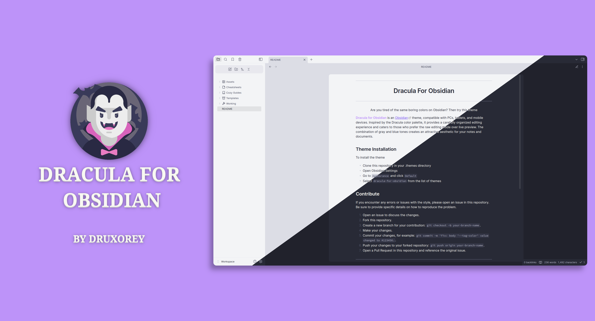

<h1 align="center">Dracula For Obsidian</h1>

Are you tired of the same boring colors on Obsidian? Then try this theme

**Dracula for Obsidian** is an [Obsidian](https://obsidian.md/) theme, compatible with PCs, tablets, and mobile devices. Inspired by the Dracula color palette, it provides a carefully organized editing experience and caters to those who prefer the raw editing mode over live preview. The combination of gray and blue tones creates an attractive aesthetic for your notes and documents.

## Theme Installation

To install the theme

- Clone this repository in your .themes directory
- Open Obsidian Settings
- Go to `Appearance` and click `Default`
- Select `dracula-for-obsidian` from the list of themes

## Contribute

If you encounter any errors or issues with the style, please open an issue in this repository. Be sure to provide specific details on how to reproduce the problem.

1. Open an issue to discuss the changes.
2. Fork this repository.
3. Create a new branch for your contribution: `git checkout -b your-branch-name`.
4. Make your changes.
5. Commit your changes, for example: `git commit -m 'fix: body '--tag-color' value changed to #123456.`.
6. Push your changes to your forked repository: `git push origin your-branch-name`.
7. Open a Pull Request in this repository and reference the original issue.

## License

This project is licensed under the GPL-3.0 License. See the [LICENSE](LICENSE) file for more details.
